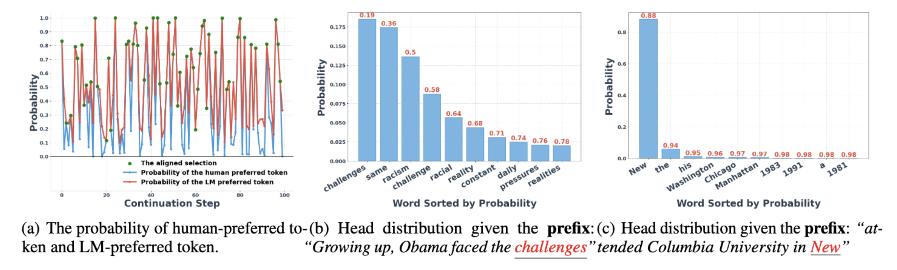
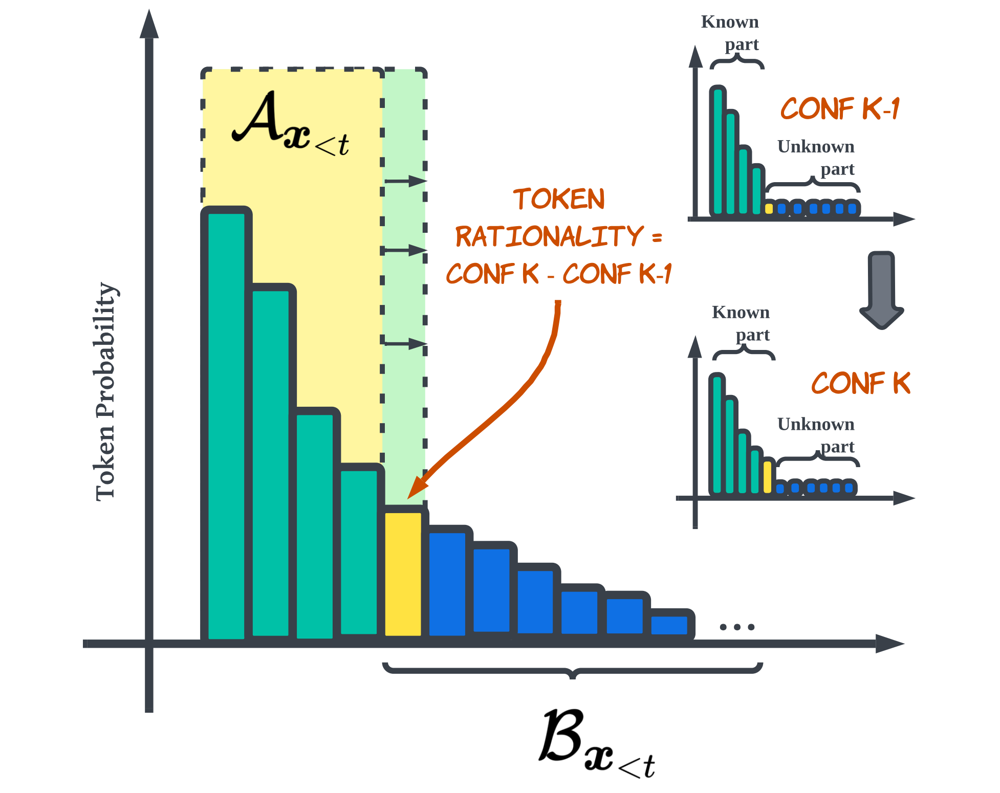
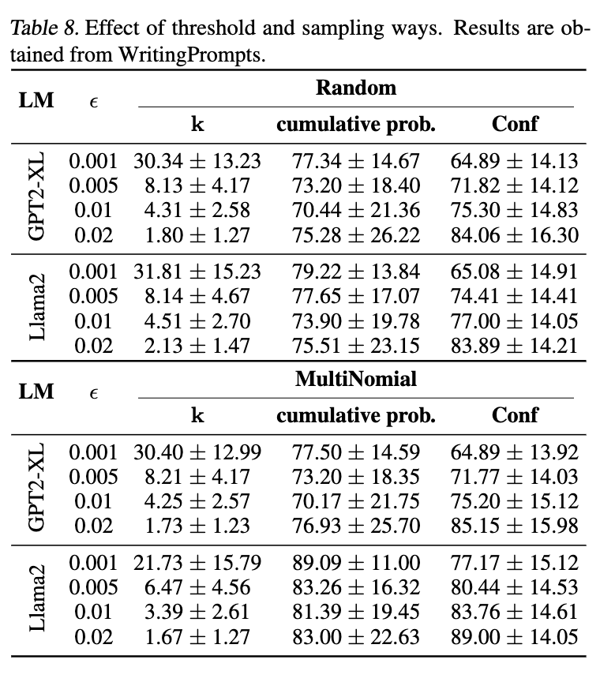

# Adaptive decoding [[paper]](https://arxiv.org/abs/2402.18223)


**TL;DR:** Our new decoding algorithm, Adaptive Decoding, balances the diversity and coherence of open-ended text generation.

## Update
- [2024/5/31] we integrate our method into transformers.
- [2024/5/1] our paper is accepted by ICML2024.
- [2024/2/15] we first release our code and our paper.

## Background
<center>

</center>

During the generation process, the distribution predicted by the language model (LM) generally falls into two categories.  The first is a flattened distribution, indicating that the LM has multiple potential choices for the next token.  The second is a sharp distribution, suggesting that the model's choices are more limited.  Ensuring that the model dynamically understands the current state is crucial for generating sentences with high diversity and high coherence.

## Abstract
Current language models decode text token by token according to probabilistic distribution, and determining the appropriate candidates for the next token is crucial to ensure generation quality. This study introduces adaptive decoding, a mechanism that dynamically empowers language models to ascertain a sensible candidate set during generation.  Specifically, we introduce an entropy-based metric called confidence and conceptualize determining the optimal candidate set as a confidence-increasing process. The rationality of including a token in the candidate set is assessed by leveraging the increment of confidence. 

<center>

</center>


**Method**: Each distribution predicted by the language model can be conceptualized as a state comprising two sets: the candidate set **A** and the ordered set **B**, wherein tokens are arranged by their probabilities. By iteratively selecting the token with the highest probability from **B** and adding it to **A**, we can gauge the increment in confidence, which reflects the rationality of incorporating this token into the candidate set.

<center>

</center>

**Results**: Experimental results reveal that our method balances diversity and coherence well. The human evaluation shows that our method can generate human-preferred text. Additionally, our method can potentially improve the reasoning ability of language models. 

Detailed information can be found in our [paper]((https://arxiv.org/abs/2402.18223)).

## Installation
```
pip install -e transformers-main
```


## Usage

**Hyperparameter**: There is only one hyperparameter we need to tune for optimal generation, and the recommended values are 0.001 or 0.0005.


<center>

</center>


```python
import os 
import torch
import numpy as np
import torch.nn as nn
from transformers import AutoTokenizer, AutoModelForCausalLM
from tqdm import tqdm
from pprint import pprint 

os.environ['CUDA_VISIBLE_DEVICES'] = "0"
if torch.cuda.is_available():
    print ('Cuda is available.')
cuda_available = torch.cuda.is_available()
device = 'auto'

model_name = 'meta-llama/Llama-2-7b-chat-hf'
tokenizer = AutoTokenizer.from_pretrained(model_name)
model = AutoModelForCausalLM.from_pretrained(model_name, device_map=device, torch_dtype=torch.float16)
model.eval()


bos_token_id = tokenizer.bos_token_id
eos_token_id = tokenizer.eos_token_id
pad_token_id = tokenizer.pad_token_id if tokenizer.pad_token_id else eos_token_id

device = model.device

sentence = "Paige had 11 songs on her mp3 player. If she deleted 9 old songs from it and then added 8 new songs, how many songs does she have on her mp3 player? "

prefix = f'''<s>[INST] <<SYS>>You are a help assistant and a math expert. Please solve the following question and directly return me the answer.<</SYS>>
Problem: {sentence} 
Let's think step by step\n[/INST]
'''
tokens = tokenizer.tokenize(prefix)
prefix_id_list = tokenizer.convert_tokens_to_ids(tokens)
input_ids = torch.tensor(prefix_id_list).to(device).repeat(1, 1)

input_ids = model.generate(input_ids, max_new_tokens=512, do_sample=True, ada=5e-4, bos_token_id=bos_token_id, eos_token_id=eos_token_id, pad_token_id=eos_token_id)
generated_results = tokenizer.batch_decode(input_ids, skip_special_tokens=True)
pprint(generated_results)

```
**Generation:**
```
["Of course! I'd be happy to help you solve this problem. Here's the step-by-step calculation:\n\n1. Paige had 11 songs on her mp3 player initially.\n2. She deleted 9 old songs from her mp3 player, so she has 11 - 9 = 2 songs left.\n3. Then, she added 8 new songs to her mp3 player, so she has 2 + 8 = 10 songs on her mp3 player now.\n\nTherefore, Paige has 10 songs on her mp3 player after deleting 9 old songs and adding 8 new ones."
```


## Citing our paper
If adaptive decoding or this repository is useful in your own research, you can use the following BibTeX entry. Thanks!🤗🤗🤗
```
@misc{zhu2024improving,
      title={Improving Open-Ended Text Generation via Adaptive Decoding}, 
      author={Wenhong Zhu and Hongkun Hao and Zhiwei He and Yiming Ai and Rui Wang},
      year={2024},
      eprint={2402.18223},
      archivePrefix={arXiv},
      primaryClass={cs.CL}
}
```