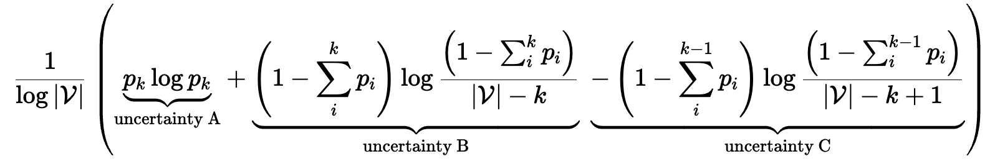

# Adaptive decoding

**TL;DR:** Our new decoding algorithm, Adaptive Decoding, enhances the diversity and coherence of open-ended text generation.
## Background

During the generation process, the distribution predicted by the language model (LM) generally falls into two categories.  The first is a flattened distribution, indicating that the LM has multiple potential choices for the next token.  The second is a sharp distribution, suggesting that the model's choices are more limited.  Ensuring that the model dynamically understands the current state is crucial for generating sentences with high diversity and high coherence.

## Introduction
We propose a novel decoding algorithm termed Adaptive Decoding, which leverages entropy principles. Each distribution predicted by the language model can be conceptualized as a state comprising two sets: the candidate set **A** and the ordered set **B**, wherein tokens are arranged by their probabilities.

By iteratively selecting the token with the highest probability from **B** and adding it to **A**, we can gauge the increment in confidence, which reflects the rationality of incorporating this token into the candidate set.

<center>

</center>

Detailed information can be found in our paper.

## Usage
```python
import torch
import numpy as np
import torch.nn as nn
from transformers import AutoTokenizer, AutoModelForCausalLM
from adaptive import adaptive_decoding

if torch.cuda.is_available():
    print ('Cuda is available.')
cuda_available = torch.cuda.is_available()
device = torch.device('cuda')

# Load your model
model_name = 'gpt2-xl'
tokenizer = AutoTokenizer.from_pretrained(model_name)
model = AutoModelForCausalLM.from_pretrained(model_name, device_map=device, torch_dtype=torch.float32)
model.eval()

# Using adaptive decoding
prefix = "The city's growth has reflected the push and pull of many social and economic factors."
max_len = 256
epsilon = 0.001
results = adaptive_decoding(model, tokenizer, prefix, max_len, epsilon)
```
**Generation:**
```
The city's growth has reflected the push and pull of many social and economic factors.  Some places are flourishing, while others are struggling.

When the Great Recession began in 2008, downtown Charlotte started losing people, and soon downtown lost nearly 3,000 residents since 2010, Census estimates show.

As new development has come to the heart of Charlotte, the city's once-thriving downtown area has lost nearly one-quarter of its population from 2010 to 2015, more than any other area in the city, U.S. Census data shows.  (Downtown's population has since been climbing.)

While some people may now say the city is thriving, there are signs that downtown is becoming increasingly unaffordable.  For instance, rent rates in the city as a whole increased by 28 percent from 2002 to 2015, according to a report from real estate analytics firm Axiometrics.

At the same time, many downtown jobs have been displaced, as well.

The jobs displaced in the Charlotte area include retail management, retail sales and service, home furnishings, restaurant management, general office support, administrative support, and travel and hospitality.

So, what's going on?  And what can people do to keep downtown growing?

What's going on in the Charlotte area

There are several reasons why Charlotte is
```


## Citing our paper
If adaptive decoding or this repository is useful in your own research, you can use the following BibTeX entry:
